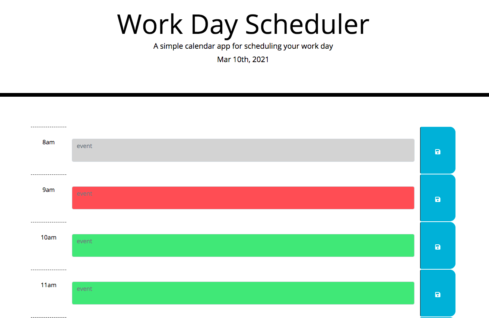

# Calendar

A simple calendar application that allows the user to add events/tasks for each hour of the day. Each hour is color coded based on the current time. The events/tasks added by the user will be available to the user after a page refresh. This app runs in the browser and features dynamically updated HTML and CSS powered by jQuery and Moment.js.

# Built with

-HTML
-CSS
-Bootstrap
-Javascript
-JQuery
-Moment.js

# Link

https://barbarashea.github.io/calendar/

# Preview

